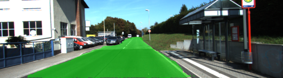
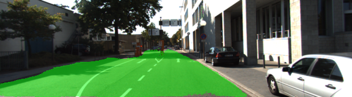

# CarND-Semantic-Segmentation # 
Self-Driving Car Engineer Nanodegree Program

---

## Introduction ##

This is my solution to the Semantic Segmentation project of the Udacity Self-Driving Car Engineer Nanodegree Program. The goal for the project is to label the pixels of a road in images using a Fully Convolutional Network (FCN).

[Kitti Road dataset](http://www.cvlibs.net/datasets/kitti/eval_road.php) is used to train my FCN, which can be downloaded from [here](http://www.cvlibs.net/download.php?file=data_road.zip).

## Implementation ##

My FCN is based on pre-trained VGG16 model. Here is the Here are my steps.

Layer3, 4 and 7 are extracted from VGG16 model. 

Add a 1 * 1 convolutional layer after layer 7. 

Add the first transposed convolutional layer with kernel 4 and stride 2 after the 1 * 1 convolutional layer above.

Add a 1 * 1 convolutional layer after layer 4.

Add the 1 * 1 convolutional layer after layer 4 and the first transposed convolutional layer to get the first skip layer.

Add the second transposed convolutional layer with kernel 4 and stride 2 after the first skip layer.

Add a 1 * 1 convolutional layer after layer 3.

Add the 1 * 1 convolutional layer after layer 3 and the second transposed convolutional layer to get the second skip layer.

Add the last transposed convolutional layer with kernel 16 and stride 8 after the second skip layer.

For each convolutional layer and tranposed convolutional layer, a truncated_normal initializer wih standard deviation 0.01 and L2 regularizer with L2 0.001 is used. Moreover, an additional term for regularization loss with scaling factor 0.01 is manually added to the loss function.

Optimizer: Adam optimizer. Cross-entropy is the base term of the loss function. Here are hyperparameters' values.

Keep probability: 0.75.

Learning rate: 0.0001

Epoch: 50

Batch size: 8

Here are some examples.






### Setup

##### Frameworks and Packages
Following tools are needed:
 - [Python 3](https://www.python.org/)
 - [TensorFlow](https://www.tensorflow.org/)
 - [NumPy](http://www.numpy.org/)
 - [SciPy](https://www.scipy.org/)

##### Run
Run the following command to run the project:
```
python main.py
```
 
